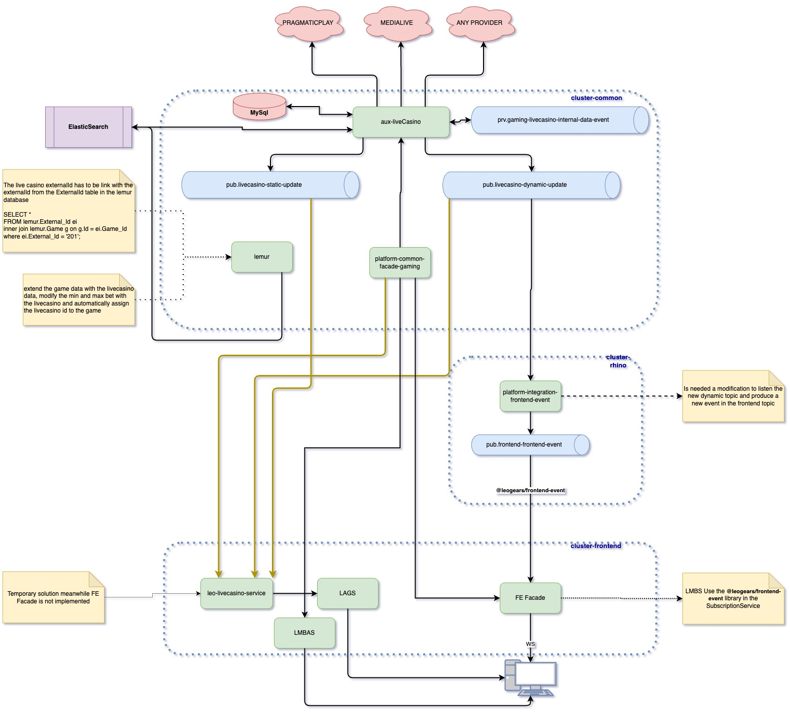
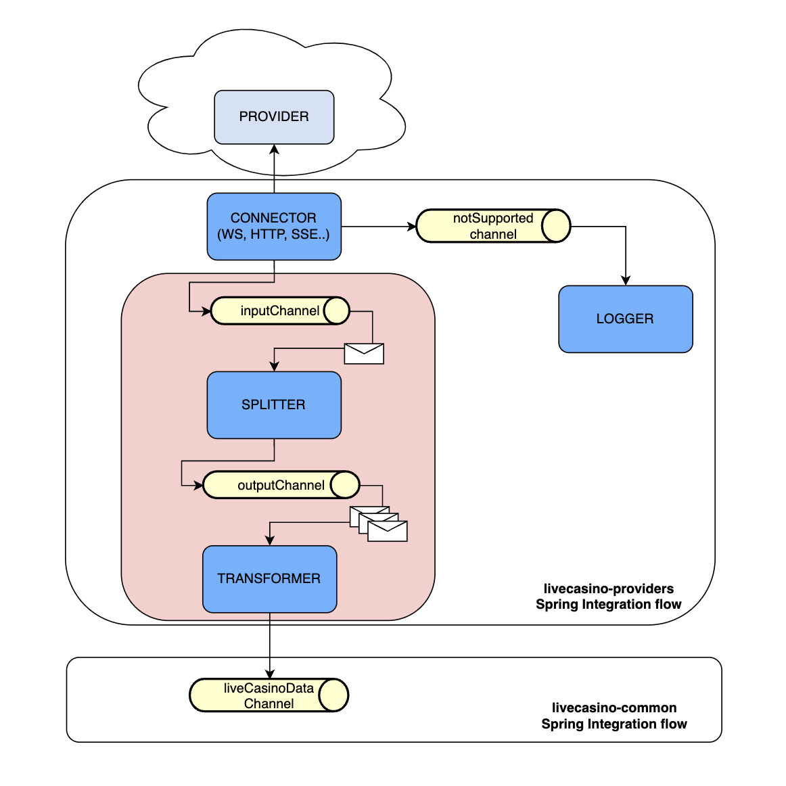
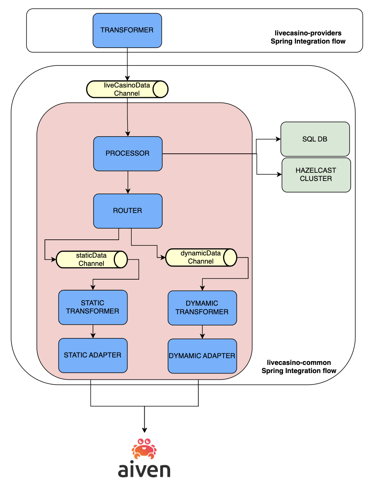

# LiveCasino Service Overview
LiveCasino service is responsible for handling live casino table data.
It connects with every configured and enabled provider to start reading the live casino data of the different available games
in the lobbies to transform this data into the internal model so that the Frontend application can subscribe to and 
render it in the tiles of the games.

Following a high level block of the integration:
### High level block diagram 

# Project modules
The project is a Multi-Module Maven project with the following structure:

### platform-aux-livecasino-api
Module that contains the Protobuf contract to build the DTOs of the exposed API by the service.
For this purpose the plugin `protobuf-maven-plugin` is used as in other services of the platform.

### platform-aux-livecasino-common
Module that contains the common dependencies as well as the common POJOs to use by the different modules.

### platform-aux-livecasino-feign-client
Module that build the Feign API client for the exposed endpoints by the service so that other platform services
can inject and use in case they need to get the LiveCasino Dynamic data from the providers.

### platform-aux-livecasino-parent
Module that provide the parent POM file of the application with the main Hyraco dependencies in it.

### platform-aux-livecasino-providers
Module with one submodule per provider. Each of these submodules contains the code of the integration with a provider.
The providers that the service integrates with are:

- <ins>**Authentic**</ins>: Integration done by polling the data via HTTP by using Feign Clients. The polling of the data is composed of 3 different requests:
One to get the Game data, a second one to get the Outcome data and a last request to get the live data. Then the response of the 3 requests are aggregated into a common DTO.

- <ins>**Evolution**</ins>: Integration done by connecting via WebSocket to the different lobbyIds. Once the connection is established a first message is received with the State of every table available at that time
to then start receiving the specific Live data per each of the tables separately.

- <ins>**PlayTech**</ins>: This integration needs two different type of connections to get the data from the provider. There is a first phase to get the initial data from the studios composed by the different tables and their limits.
Then a second phase to receive the Live data via Kafka events. The studios that the data is fetch are: Europe, Asia, Italy, United Kingdom and Spain.

- <ins>**PragmaticPlay**</ins>: Integration done by connecting via WebSocket to the different casinoIds. The connections is done in two steps: first one to connect to the casino and then 
subscribing to it to start getting the Live casino data. Once the subscription is done the data from the different games start being received.

- <ins>**StakeLogic**</ins>: Integration done by connecting via SSE (Sever Side Events) to the different lobbyIds. Once the connection is established a first message is received with the State of every table available at that time
to then start receiving the specific Live data per each of the tables separately.

### platform-aux-livecasino-service
This is the Main module of the application because it runs the SpringBoot Application. It also contains the application configuration properties for the
different integrations as well as the common flow to receive the LiveCasino data object from the different integrations in order to save the Static data, populate 
the cache with the Dynamic one and then provide both via Kafka to the external systems (Lemur and Frontend Integration)

# Spring Integration Framework
The liveCasino solution has been implemented by using [Spring Integration Framework](https://spring.io/projects/spring-integration).
This was decided due to the fact that every single integration with a provider would follow the same steps which matches
with the idea of having individual components with Single Responsibility within the application which leads to benefits such as 
getting a Open-Closed and easy testable implementation.

Besides each implementation does have its peculiarities, the different components provided by this Framework give the 
opportunity to solve each one by just binding the components in the correct way in a single descriptive configuration file.

# Implementation design
As mentioned the implementation is done by using Spring Integration, the solution is done by having two different flows: 
One first flow built by provider and a second one which is common and receive the normalized data by every provider to 
save the data and produce the static and dynamic data to different Kafka topics for the different external systems.

The first flow is very similar across provider even though it is adapted to each one based on the way they send the data.
Beside the peculiarity of each provider the flow can be described in 3 different phases:
- Connect to the provider and put the event into the flow.
- Split the event into different ones per data game received in the event.
- Transform the data from the provider and normalized it to the internal model.

The second flow is a common flow performed for every provider. The normalized data is sent to the entry of this flow and then
the LiveCasino data received is saved in the SQL database and the Hazelcast cache populated with it. The second phase of this flow
is sending via Kafka the LiveCasino data splitted into Static and Dynamic into different topics for the external systems, Lemur for
the static data and Frontend integration for the Dynamic one.

Find below a diagram with the mentioned design showing the two different flows:
### Provider integration flow diagram

### Common flow diagram

# Runtime
Aligned with the current status of the rest of the services in the Platform, the LiveCasino runtime is the Java Runtime version 17 (LTS).
